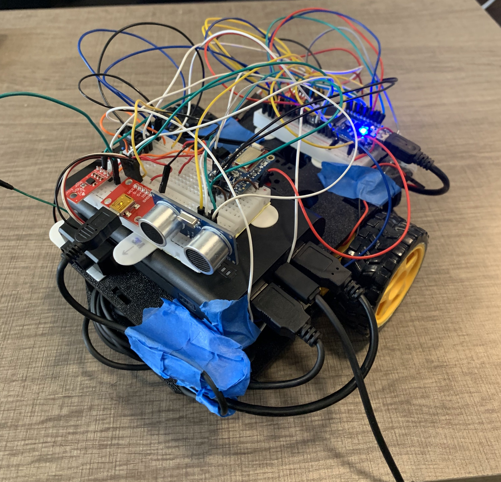
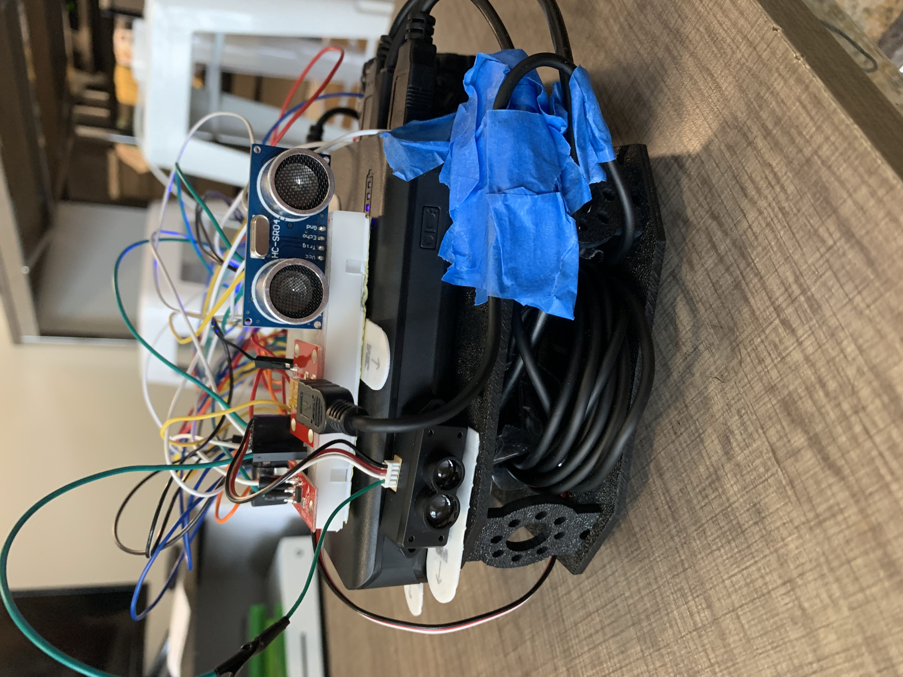
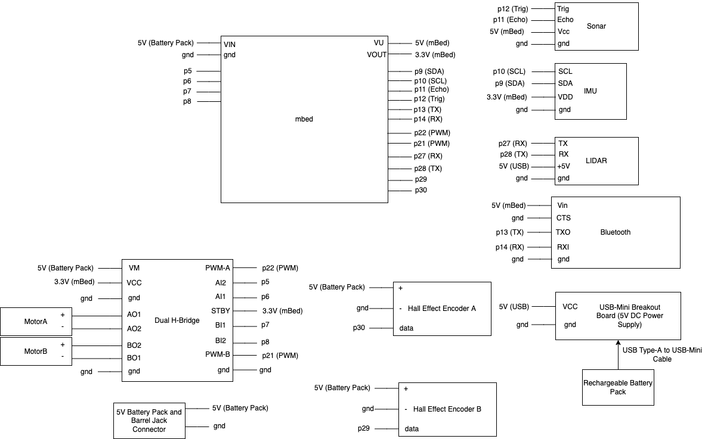
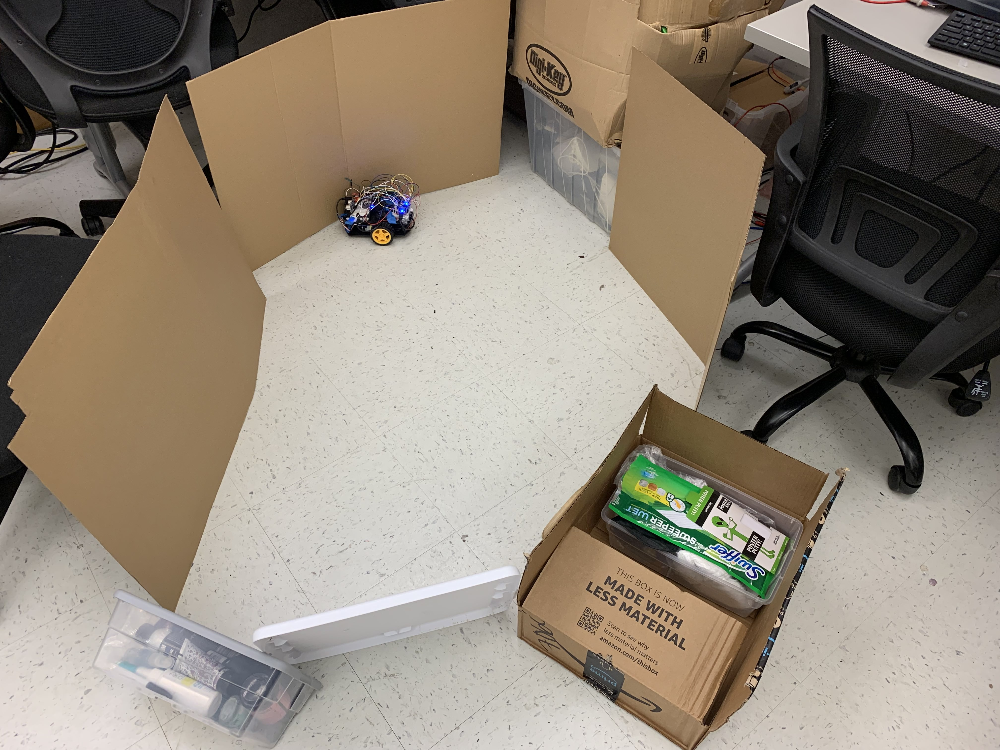
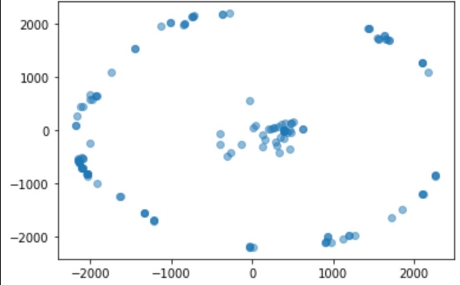

# ECE4180AutonomousMappingRobot
Team: Gaurav Krishnan and Auveed Rokhsaz

## Description
This project is an autonomous robot that maps its environmnent. The robot autonomously moves using collision detection with the Sonar and the LIDAR. It stochastically decides its next direction. The LIDAR distance data along with the robot pose is used to create a point cloud map.

## Components
- mbed LPC1768
- Sonar: HC-SR04
- IMU: SparkFun 9DoF Sensor Stick (LSM9DS1 IMU)
- LIDAR (ToF Sensor): TFmini
- Bluetooth Module: Adafruit Bluefruit LE UART
- USB Mini-B Breakout Board: Sparkfun BOB-09966
- Dual H-Bridge: SparkFun Motor Driver - Dual TB6612FNG
- DC Motors: [140 RPM DC Motors](https://www.sparkfun.com/products/13302)
- Hall Effect Encoders: [ Wheel Encoder Kit](https://www.sparkfun.com/products/12629)
-  Chassis: [Shadow Chassis](https://www.sparkfun.com/products/13301)
- Wheels:  [65mm Rubber Wheels](https://www.sparkfun.com/products/13259)
- Battery Holder: [4xAA to Barrel Jack Connector](https://www.sparkfun.com/products/9835)
- Barrel Jack Connector:  [DCJ250-10-A-K1-K](https://www.digikey.com/en/products/detail/gct/DCJ250-10-A-K1-K/9859581?utm_adgroup=Connectors%2C%20Interconnects&utm_source=google&utm_medium=cpc&utm_campaign=Shopping_Supplier_GCT_2073_Co-op&utm_term=&utm_content=Connectors%2C%20Interconnects&gclid=Cj0KCQjw37iTBhCWARIsACBt1IxXAZYODS225zWdM0VeJaj4e-yxArjhKsf0ZLDeHYVMIf1OSv5QMgkaAgz0EALw_wcB)
- Rechargeable Battery Pack

## Pin Setup

- Note: There are THREE 5V lines (the rechargeable battery pack, the battery pack, and the mbed 5V line)

## Software Overview
The mbed controls the motors, sensors, and data distrubution. Then an external computer handles the data visualization. The mapping does not occur in real time so the LIDAR data that gets sent over the bluetooth module to the Bluefruit app is exported to the external computer. The external computer then runs a Python script to visualize the mapping data.

#### mbed
- Controls the motors
- Uses the sonar and LIDAR to avoid collisions
- Every 12 seconds the robot performs a full rotation to gather data since the lidar unidirectional
- Reads in sensor data (LIDAR, hall effect encoders, IMU) and calculates the robot's pose
- Sends the LIDAR mapping data over bluetooth to the Bluefruit app
#### Mobile Device
- Uses the Bluefruit mobile application to receive data from the bluetooth module
- The LIDAR data can be seen through the UART console window
- The data can be exported  to a text file and then loaded onto a computer
#### Python Script
- Parses the given mapping coordinates from the exported text file
- Plots the data points using Matplotlib

## Software Setup
#### mbed
The following libraries are required for the project and can be added through the ARM mbed online compiler or Keil Studio Cloud:
	- RTOS
	- LSM9DS1 IMU Library
	- Motor Library

The project can then be compiled using either of the above compilers and then downloaded to the mbed board.

#### mobile device
- Install the [Bluefruit Connect](https://learn.adafruit.com/bluefruit-le-connect?view=all&gclid=Cj0KCQjw37iTBhCWARIsACBt1IyN2FyelZSo58QsqCARG32rwinUx53A9Tu6T5rpXAfdiqn_zn3mBVQaAonAEALw_wcB) mobile application 
#### Python Script
- The Python script can be ran through Google Collab
- If it needs to be ran locally, then Matplotlib and Python will need to be installed

## Demo Video
[https://youtu.be/Zv56OlEs6xE](https://youtu.be/Zv56OlEs6xE)
[Presentation Slides](https://docs.google.com/presentation/d/1VSTJImyKf1XH3ImKL-f7cBEPrD-M7PTjvLKUh0W3dwo/edit?usp=sharing)

## Results

